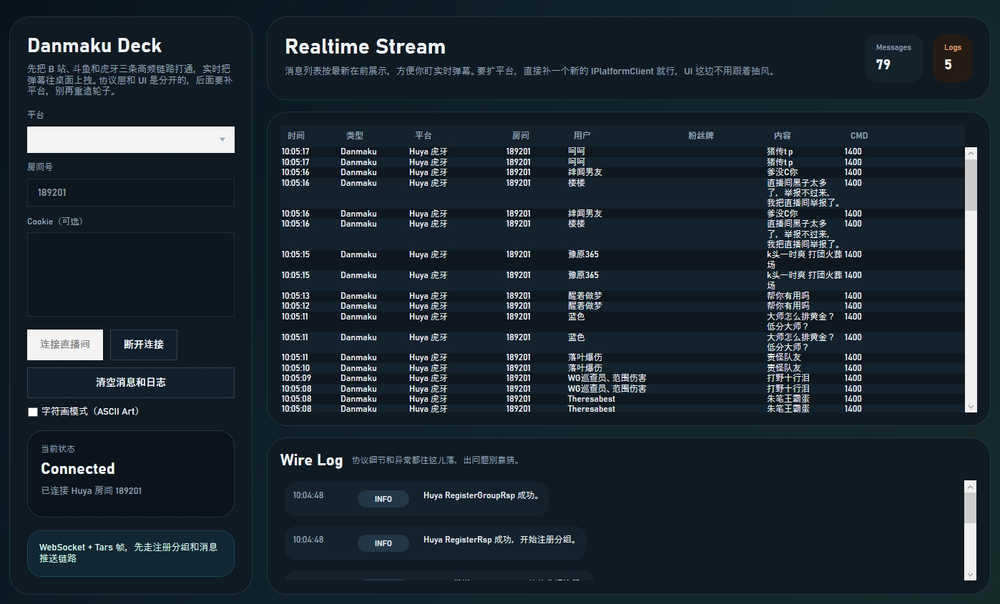

# LiveChatDanmakuViewer


> This project is in progress.
>
> `LiveChatDanmakuViewer` 是 `ordinaryroad-live-chat-client` 的 C# 桌面端 Viewer，目标是统一接入多平台直播弹幕并实时展示。
>
> 原作者项目地址：<https://github.com/OrdinaryRoad-Project/ordinaryroad-live-chat-client>

* * *

## 项目特色

- Feature 0: 基于 `.NET 5.0` + `WPF` 的桌面端实现。
- Feature 1: 统一 `IPlatformClient` 抽象，协议层和 UI 层解耦。
- Feature 2: 已接入 `Bilibili`、`Douyu`、`Huya`。
- Feature 3: 通过统一消息模型 `LiveMessage` 呈现弹幕、礼物和事件。

## 平台适配情况表

| 平台 | Viewer 接入 | 说明 |
| --- | --- | --- |
| Bilibili B 站 | ✅ | HTTP 初始化 + WebSocket 鉴权 + zlib |
| Douyu 斗鱼 | ✅ | 双通道 + STT 协议 |
| Huya 虎牙 | ✅ | WebSocket + Tars |
| Douyin 抖音 | ☑️ | 已分析，Viewer 暂未接入 |
| Kuaishou 快手 | ☑️ | 已分析，Viewer 暂未接入 |

## 快速开始

```powershell
dotnet run --project .\src\LiveChatDanmakuViewer\LiveChatDanmakuViewer.csproj
```

## 截图展示



## 文档

- 详细项目介绍：`docs/project-introduction.md`
- 协议分析：`docs/live-chat-protocol-analysis.md`

## 项目来源与开源协议

- 原作者项目地址：<https://github.com/OrdinaryRoad-Project/ordinaryroad-live-chat-client>
- 开源协议：`MIT License`
- 协议文件：<https://github.com/OrdinaryRoad-Project/ordinaryroad-live-chat-client/blob/main/LICENSE>
